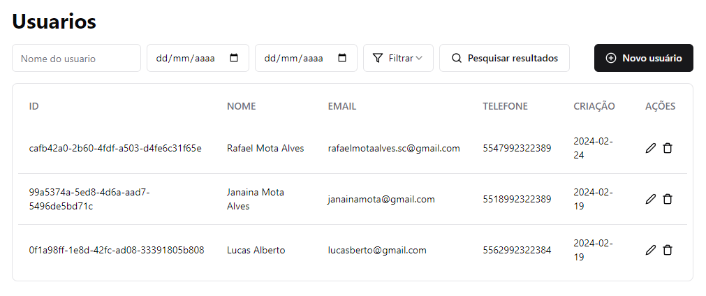

# Sistema de Cadastro e Busca de Usuários - Teste Full Stack



## Sobre

O Sistema de Cadastro e Busca de Usuários é uma aplicação full stack desenvolvida como parte de um teste para uma vaga de emprego. Ele consiste em uma API RESTful no backend e uma interface de usuário no frontend para permitir o cadastro e a busca de usuários. 

A API foi construída utilizando TypeScript, Node.js, Docker, Zod, Prisma, PostgreSQL, Vitest e Fastify, enquanto o frontend foi desenvolvido com TypeScript, React, React Query, Vite, TailwindCSS e Shadcn/UI.

## Funcionalidades

- **Cadastrar Usuário**: Endpoint para criar um novo usuário.
- **Atualizar Usuário**: Endpoint para atualizar informações de um usuário existente.
- **Deletar Usuário**: Endpoint para remover um usuário do sistema.
- **Buscar Usuários**: Endpoint para obter uma lista de todos os usuários cadastrados.
- **Buscar Usuários por Nome**: Endpoint para buscar usuários com base em um nome específico.
- **Buscar Usuários por Data Específica**: Endpoint para buscar usuários cadastrados em uma data específica.
- **Buscar Usuários em Ordem Crescente**: Endpoint para obter uma lista de usuários ordenada de forma crescente.
- **Buscar Usuários em Ordem Decrescente**: Endpoint para obter uma lista de usuários ordenada de forma decrescente.
- **Buscar Usuários por Período**: Endpoint para buscar usuários cadastrados dentro de um período de datas específico.

## API

Todos os endpoints da API começam com `/users`.

- **POST Criar Usuário**: `/users`
- **GET Pegar Usuários**: `/users`
- **GET Pegar Usuários pelo Nome**: `/users/name/:name`
- **GET Pegar Usuários por Data Específica**: `/users/:date`
- **GET Pegar Usuários em Ordem Crescente**: `/users/asc`
- **GET Pegar Usuários em Ordem Decrescente**: `/users/desc`
- **GET Pegar Usuários por Período**: `/users/period?startDate=YYYY-MM-DD&endDate=YYYY-MM-DD`
- **PATCH Atualizar Usuário**: `/users/:userId/update`
- **DELETE Deletar Usuário**: `/users/:userId/delete`

## Como Executar?

### Pré-requisitos

- É necessário ter o **[Git](https://git-scm.com/)** e o **[Docker](https://www.docker.com/products/docker-desktop/)** instalados e configurados em seu computador.
- Além disso, é preciso ter um gerenciador de pacotes como **[Yarn](https://yarnpkg.com/)** ou **[NPM](https://www.npmjs.com/)** instalado.
- Por fim, é necessário ter o **[Node.js](https://nodejs.org/en)** na versão 16.13.x ou superior.

### Instalação do Backend

1. Instale as dependencias

```sh
  $ npm install # ou yarn install para instalar todas as dependências.
```

2. troque o .env.example para .env

3. Inicialize o container

```sh
  $ npm run up
```

3. Rode as migrations

```sh
  $ npm run migrate:dev
```

3. Inicialize o servidor

```sh
  $ npm run dev
```


### Instalação do Frontend

1. Instale as dependencias

```sh
  $ npm install # ou yarn install para instalar todas as dependências.
```

2. Inicialize o servidor

```sh
  $ npm run dev
```


# Após iniciar ambos os projetos, a aplicação estará pronta para ser utilizada! 🎉
